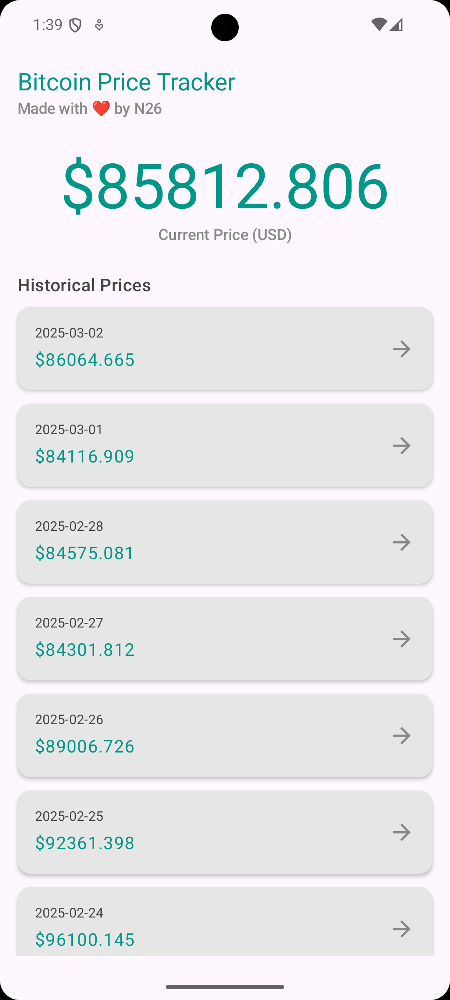
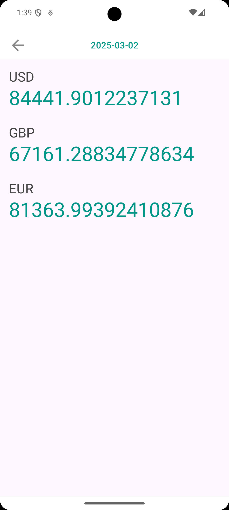
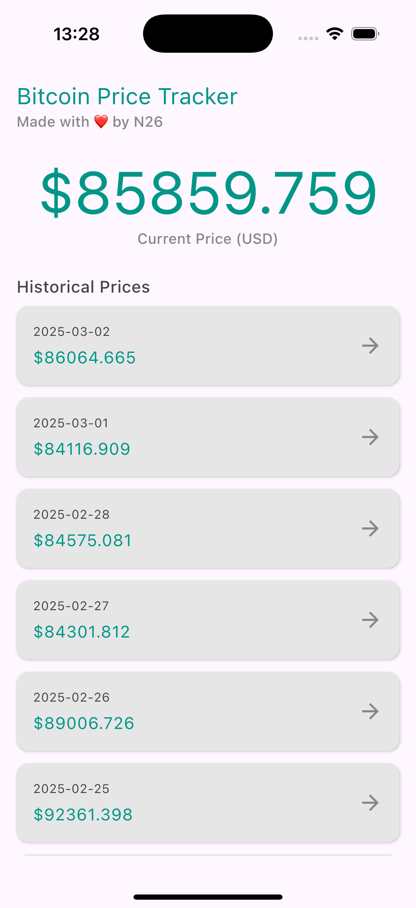
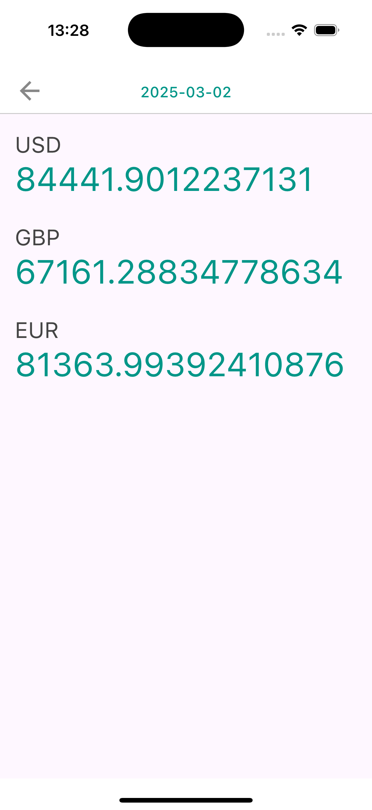

# N26 Bitcoin Price Tracker

This is a Kotlin Multiplatform app built as a coding assignment for N26.
The app fetches and displays Bitcoin’s current exchange rate (in EUR) along with historical prices for the past two weeks.

- **List Screen:**  
  Displays historical prices (one representative price per day) along with a real‑time current price updated every 60 seconds. Tapping a day navigates to a detail screen.

- **Detail Screen:**  
  Shows the Bitcoin price on a selected day in EUR, USD, and GBP with a persistent top bar featuring a back button and the day’s date.

---

## Screenshots

### Android

### iOS

---

## Features

- **Real-Time Refresh:**  
  The current price auto-refreshes every minute when the screen is active, using lifecycle-aware coroutines.

- **Historical Data Aggregation:**  
  Multiple data points per day are grouped by UTC day boundaries (e.g., using the last recorded value as the “closing” price).

- **Type-Safe Navigation:**  
  Navigation is implemented using sealed classes and typed arguments to minimize errors.

- **Lifecycle-Aware UI:**  
  Custom effects ensure that auto-refresh operations run only when the screen is resumed.

- **Clean Architecture:**  
  Separation of concerns through interactors, view models, and data sources with caching and error handling.

---

## Technologies

This project leverages several key multiplatform libraries:

The data displayed by the app is from [CoinGecko API](https://docs.coingecko.com/v3.0.1/reference/introduction/).

- **UI & Navigation:**
    - [Compose Multiplatform](https://jb.gg/compose)
    - [Navigation Compose](https://developer.android.com/jetpack/compose/navigation)

- **Networking & Serialization:**
    - [Ktor](https://ktor.io/)
    - [kotlinx.serialization](https://github.com/Kotlin/kotlinx.serialization)

- **Dependency Injection:**
    - [Koin](https://github.com/InsertKoinIO/koin)

- **Concurrency:**
    - [kotlinx.coroutines](https://github.com/Kotlin/kotlinx.coroutines)

- **Date Handling:**
    - [kotlinx.datetime](https://github.com/Kotlin/kotlinx-datetime)

- **Logging:**
    - [Kermit](https://kermit.touchlab.co)

- **Build configuration:**
    - [BuildKonfig](https://github.com/yshrsmz/BuildKonfig)
---

## Setup and Running

### Android

- Open the project in Android Studio.
- Ensure your Android emulator or device is connected.
- Build and run the app.

### iOS

- **Requirements:**  
  Ensure you’re on a Mac with Xcode installed.

- **Configuration:**  
  Set your iOS signing settings (TEAM_ID, BUNDLE_ID, APP_NAME) in your config file.

- **Running:**  
  Open the generated Xcode project, select an available iOS simulator, and build & run the app.

**Note:** The Public API restricts historical data to the past 365 days only. A Pro-API key is required for the complete range.

---

## Project Structure

- **Feature Modules:**
    - **Home:**  
      Contains the list screen with historical prices and current price auto-refresh.
    - **Details:**  
      Displays detailed price information for a selected day.

- **Core:**  
  Shared business logic, domain models, and interactors.

- **Data:**  
  Networking, caching, and remote data sources.

- **UI:**  
  Common design system and theming.

---

## Navigation & Lifecycle

- **Navigation:**  
  The app uses a simple navigation setup with typed routes (e.g., sealed classes) to manage transitions between the Home and Detail screens.

- **Lifecycle-Aware Refresh:**  
  A custom `LifecycleResumeEffect` ensures that auto-refresh tasks (like fetching the current price every 60 seconds) run only when the screen is resumed, minimizing unnecessary network calls.

- **Date & Time Handling:**  
  Dates are consistently converted using UTC for API calls and then to local time for display, ensuring that day boundaries are handled correctly across time zones.

---

## Customization & Branding

- **N26 Branding:**  
  The app uses N26’s brand color (Teal 500, typically `#009688`) throughout the UI for consistency.

- **UI Design:**
    - The home screen features a modest title ("Bitcoin Price Tracker") with a subtitle ("❤ made with love by n26").
    - The current price is prominently displayed in a large, animated font and centered.
    - Historical prices are listed in a vertical list with each row showing a formatted date and price, along with a forward arrow icon to indicate clickability.

---

## License

This project is licensed under the Apache License, Version 2.0. See [LICENSE](LICENSE) for details.

---

Happy coding!
